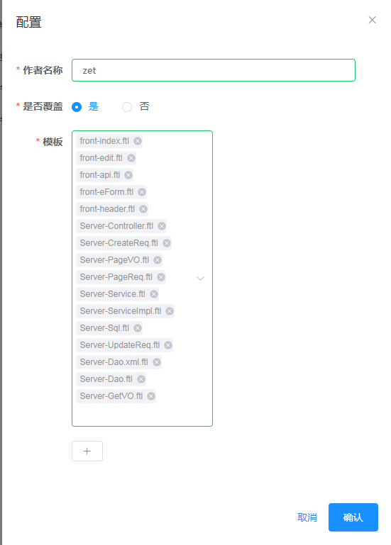

# 配置介绍

## 可视化配置

 - 作者名称：代码生成的作者;模板引用:${author}
 - 是否覆盖：是：强制生成 否：若文件已存在则不再生成
 - 模板：选择要生成的模板文件，则将利用改模板文件生成代码
 - "+" ：新增自定义配置项，配置项中支持引用系统变量，例如: D:\my_src\open_src\\${date}
 
## 配置文件 
 - 配置application.properties
 
配置项|说明
---|---
spring.datasource.druid.url|数据库连接url
spring.datasource.druid.username|数据库连接用户名
spring.datasource.druid.password|数据库连接密码
field.maps.xx|数据库字段类型映射配置,xx为类型
custom.maps.xx|自定义配置，xx为自定义的键值，例如：custom.maps.myTableName=测试表名，则模板引用为：${myTableName},则能拿到：测试表名
server.port|应用端口号
spring.profiles.active|启动的环境，开发环境用local，发布版环境必须用release

 
 > 注：
 > - custom.maps.xx,xx键值确保全局唯一不能和[系统常量](sysVariable.md)冲突
