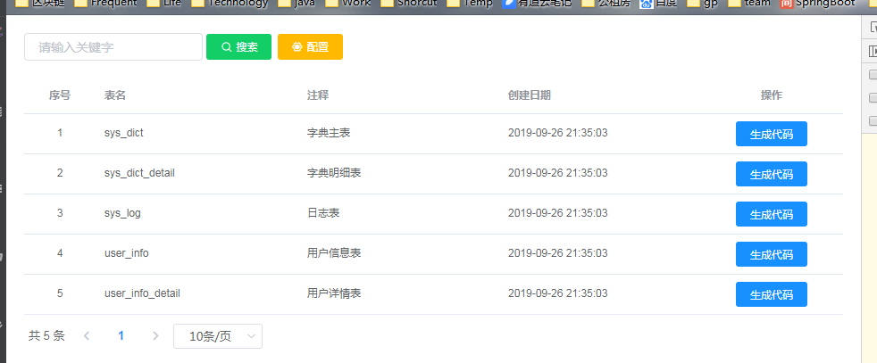

# 快速开始

 - 1.下载最新[fastgen-release](https://github.com/Zetting/fastgen/releases)包并解压到本地;
 - 2.调整数据库配置;application.properties中如下三个key值;
   - spring.datasource.druid.url:数据库名url配置;
  - spring.datasource.druid.username:用户名;
   - spring.datasource.druid.password:密码;
 - 3.双击startup.bat运行
 - 4.浏览器访问:http://localhost:8011;

 运行成功，如图所示：
 
 
 > 注：需确保已安装java jdk；
